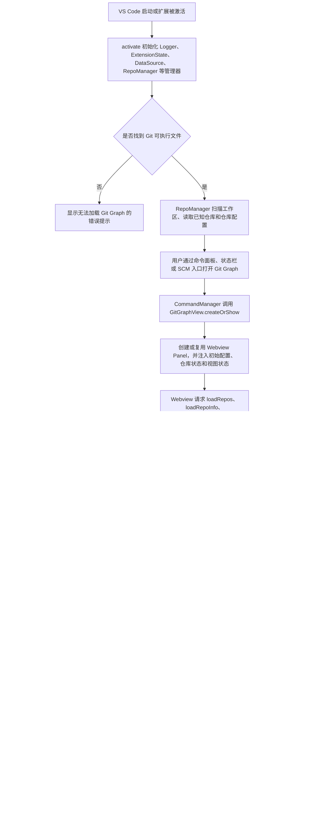
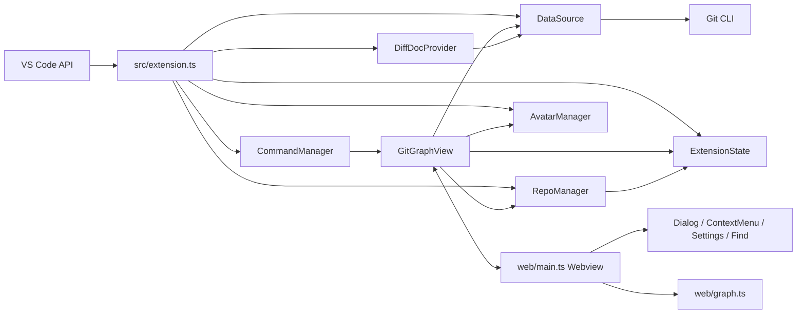

# Git Graph 项目文档

## 1. 项目概述

Git Graph 是一个 Visual Studio Code 扩展，扩展标识为 `git-graph`，显示名称为 `Git Graph`。项目目标是在 VS Code 中以图形化方式展示当前工作区 Git 仓库的提交历史，并允许用户从图形界面直接执行常见 Git 操作。

项目运行在 VS Code 扩展宿主中，前端使用 VS Code Webview 承载。扩展宿主负责发现仓库、读取配置、执行 Git 命令、维护持久化状态和调用 VS Code API；Webview 负责提交图渲染、交互控件、弹窗、上下文菜单、代码评审视图和仓库设置界面。

主要能力包括：

- 展示本地分支、远程分支、标签、stash、未提交变更和提交拓扑图。
- 查看提交详情、文件变更、两个提交之间的比较，以及 VS Code Diff 视图。
- 对分支、远程分支、提交、标签、stash 和未提交变更执行 Git 操作。
- 支持仓库级配置、Issue Linking、Pull Request 创建配置、代码评审状态记录和头像缓存。
- 支持多仓库工作区、子模块发现、工作区文件变化监听和视图状态恢复。

## 2. 业务流程图

下面是项目核心业务流程：从 VS Code 激活扩展，到用户查看提交图并执行 Git 操作。

## 3. 技术栈

| 分类 | 技术 | 项目中的用途 |
|---|---|---|
| 扩展平台 | Visual Studio Code Extension API `^1.38.0` | 命令注册、Webview、状态栏、配置、Memento、文件监听、Diff 文档提供器 |
| 主要语言 | TypeScript `4.0.2` | `src/` 扩展宿主端、`web/` Webview 前端、`tests/` 单元测试 |
| 运行时 | Node.js / VS Code Extension Host | 使用 `child_process` 执行 Git，使用 `fs/path/https/crypto/url/os` 等 Node API |
| 前端渲染 | 原生 DOM、SVG、CSS | 无前端框架；`web/graph.ts` 用 SVG 绘制提交图，`web/styles/` 管理样式 |
| Git 集成 | Git CLI | `DataSource` 通过 Git 命令读取提交、引用、差异、配置并执行操作 |
| 文本编码 | `iconv-lite` `0.5.0` | 按 `git-graph.fileEncoding` 读取指定修订版本的文件内容 |
| 构建 | `tsc`、自定义打包脚本、`uglify-js` | 编译扩展宿主端，合并并压缩 Webview JS/CSS |
| 代码质量 | ESLint `7.15.0`、`@typescript-eslint/*` | `npm run lint` 校验 `src`、`tests`、`web` |
| 测试 | Jest `26.6.3`、`ts-jest` `26.4.4` | `tests/*.test.ts` 覆盖核心逻辑和 VS Code/Git mock 场景 |
| 打包发布 | `vsce` | `npm run package` 生成 VSIX，`package-and-install` 打包后本机安装 |

核心 npm 脚本：

| 命令 | 作用 |
|---|---|
| `npm run compile` | 运行 lint，清理输出，编译扩展宿主端和 Webview 前端 |
| `npm run compile-src` | 只编译 `src/`，并执行 `.vscode/package-src.js` |
| `npm run compile-web` | 只编译 `web/`，并压缩 Webview JS/CSS |
| `npm run compile-web-debug` | 编译 Webview，输出便于调试的未混淆 JS |
| `npm run lint` | 对 `src`、`tests`、`web` 运行 ESLint，且不允许 warning |
| `npm test` | 运行 Jest 单元测试 |
| `npm run test-and-report-coverage` | 运行测试并生成覆盖率报告 |
| `npm run package` | 使用 `vsce package` 生成扩展包 |
| `npm run package-and-install` | 打包 VSIX 后调用本地安装脚本安装扩展 |

## 4. 代码结构

| 路径 | 职责 |
|---|---|
| `package.json` | 扩展元信息、命令贡献、配置项、菜单入口、脚本和依赖声明 |
| `src/extension.ts` | 扩展激活入口；初始化日志、Git 可执行文件、状态、仓库、命令、Webview、Diff Provider 等 |
| `src/commands.ts` | 注册并实现 VS Code 命令，如打开图谱、添加/移除仓库、Fetch、代码评审恢复和版本信息 |
| `src/gitGraphView.ts` | 管理 Webview Panel、HTML 注入、前后端消息协议分发、Git 操作响应和视图刷新 |
| `src/dataSource.ts` | Git CLI 适配层；执行 Git 命令、解析提交/引用/差异/配置、封装 Git 操作 |
| `src/repoManager.ts` | 工作区仓库发现、子模块发现、仓库状态管理、仓库配置导入导出和文件监听 |
| `src/extensionState.ts` | 使用 VS Code global/workspace Memento 持久化仓库、视图、代码评审、头像和 Git 路径状态 |
| `src/config.ts` | 读取 `git-graph.*` 和 `git.path` 配置，兼容旧配置项并转换为内部类型 |
| `src/diffDocProvider.ts` | 注册 `git-graph:` 文档 scheme，为 VS Code Diff 提供指定修订版本的文件内容 |
| `src/avatarManager.ts` | 按需从 GitHub、GitLab、Gravatar 获取头像并缓存 |
| `src/repoFileWatcher.ts` | 监听当前仓库文件变化，节流触发 Webview 刷新 |
| `src/types.ts` | Git 数据结构、配置结构、Webview 请求/响应消息协议和辅助类型 |
| `web/main.ts` | Webview 主控制器；仓库加载、提交表渲染、详情视图、快捷键、消息处理和状态保存 |
| `web/graph.ts` | 提交图布局算法和 SVG 渲染 |
| `web/settingsWidget.ts` | 仓库设置界面：仓库名称、初始分支、远程、Issue Linking、Pull Request 配置等 |
| `web/dialog.ts` | Webview 弹窗、表单、确认框、运行中提示和自定义下拉控件 |
| `web/contextMenu.ts` | 提交、分支、标签、stash、文件等上下文菜单逻辑 |
| `web/findWidget.ts` | 提交搜索控件 |
| `web/dropdown.ts` | 仓库和分支下拉控件 |
| `web/styles/` | Webview CSS 样式 |
| `tests/` | Jest 测试、VS Code/Git/时间 mock 和测试辅助函数 |
| `.vscode/package-src.js` | 扩展宿主端编译后的后处理，包含 `fs` fallback 和 askpass 脚本复制 |
| `.vscode/package-web.js` | Webview JS/CSS 合并、压缩和 debug 打包 |

## 5. 核心模块关系

关键设计约定：

- Webview 不直接执行 Git；所有 Git 数据读取和变更都通过 `RequestMessage` 发送给 `GitGraphView`，再由扩展宿主调用 `DataSource`。
- `DataSource` 的业务错误以 `ErrorInfo = string | null` 返回，`null` 表示成功，字符串表示可展示给用户的错误。
- `ExtensionState` 区分全局状态和工作区状态：头像缓存、全局视图状态属于 global；已知仓库、忽略仓库、代码评审、工作区视图状态属于 workspace。
- 前后端消息协议集中在 `src/types.ts`，新增 Webview 功能时需要同步请求类型、响应类型、后端 switch 分支和前端消息处理。
- `RepoFileWatcher` 在 Git 操作期间会静音，避免一次操作产生大量文件事件导致重复刷新。

## 6. 二次开发指南

### 6.1 环境准备

1. 安装 Node.js 和 npm。
2. 在仓库根目录执行 `npm install` 安装依赖。
3. 推荐在 VS Code 中打开本仓库，并安装 ESLint 扩展。
4. 首次打开或修改 `src/types.ts` 后，先执行 `npm run compile-src`，让后端类型声明可供 Webview 侧 `GG` 命名空间使用。
5. 执行 `npm run compile` 完整编译，确认扩展宿主端和 Webview 前端都能构建。

### 6.2 本地调试

1. 执行 `npm run compile-src` 或 `npm run compile`。
2. 在 VS Code 中按 F5，使用 `.vscode/launch.json` 的 `Run Extension` 配置启动 Extension Development Host。
3. 在新窗口中运行 `Git Graph: View Git Graph`，验证扩展功能。
4. 调试 Webview 时可运行 VS Code 命令 `Developer: Open Webview Developer Tools`。
5. 如果需要调试 Webview 源码，执行 `npm run compile-web-debug` 生成未混淆前端产物。

### 6.3 常见开发入口

| 需求类型 | 主要修改位置 | 注意事项 |
|---|---|---|
| 新增 VS Code 命令 | `package.json` 的 `contributes.commands`、`src/commands.ts` | 命令行为应记录日志，并给出用户可理解的错误提示 |
| 新增扩展配置项 | `package.json` 的 `contributes.configuration`、`src/config.ts`、`src/types.ts` | 如果替换旧配置，参考 `getRenamedExtensionSetting` 保持兼容 |
| 新增 Webview 与宿主通信 | `src/types.ts`、`src/gitGraphView.ts`、`web/main.ts` | 定义 Request/Response 类型，后端返回 `ErrorInfo`，前端处理成功和错误状态 |
| 新增 Git 数据读取 | `src/dataSource.ts`、`src/types.ts`、相关测试 | 使用参数数组调用 Git，解析输出时覆盖空仓库、无引用、Windows 路径和错误输出 |
| 新增 Git 写操作 | `web/contextMenu.ts` 或 `web/dialog.ts`、`src/gitGraphView.ts`、`src/dataSource.ts` | 高风险操作必须有确认或明确表单；操作期间应保持 watcher 静音逻辑 |
| 修改提交图布局 | `web/graph.ts`、`web/styles/main.css` | 注意展开提交详情、stash、未提交变更、first-parent 和 merge 场景 |
| 修改提交详情或文件列表 | `web/main.ts`、`src/dataSource.ts`、`src/diffDocProvider.ts` | 保持新增、删除、重命名、未跟踪、二进制文件的差异处理一致 |
| 修改仓库发现逻辑 | `src/repoManager.ts`、`src/extensionState.ts` | 注意 ignored repos、workspace folder 变化、子模块、外部配置导入 |
| 修改代码评审功能 | `web/main.ts`、`src/extensionState.ts`、`src/commands.ts` | 代码评审状态按仓库和 commit 或 comparison id 持久化，90 天未活动自动过期 |
| 修改头像逻辑 | `src/avatarManager.ts`、`src/extensionState.ts` | 头像抓取涉及外部网络和邮箱隐私，只在配置启用时使用 |
| 修改样式 | `web/styles/*.css` | `package-web.js` 会合并 CSS；注意 VS Code 主题变量和 Webview 尺寸变化 |

### 6.4 推荐开发流程

1. 先阅读相关源码和 `docs/business-rules/` 中的业务规则记录。
2. 若变更会影响业务流程、Git 操作语义、状态持久化或用户可见行为，先更新或补充业务规则记录。
3. 修改或新增类型时，从 `src/types.ts` 开始，确保前后端消息和数据结构一致。
4. 扩展宿主端逻辑优先放在 `DataSource`、`RepoManager`、`ExtensionState` 或 `GitGraphView` 的既有职责内，避免让 Webview 直接承担 Git 或 VS Code API 逻辑。
5. Webview 交互优先复用 `Dialog`、`ContextMenu`、`Dropdown`、`SettingsWidget` 等现有控件模式。
6. 为新增或修改的核心逻辑补充 Jest 测试，优先使用 `tests/mocks/` 中的 VS Code、spawn、date mock。
7. 本地至少执行 `npm run lint` 和 `npm test`；涉及构建产物、类型或 Webview 的改动还应执行 `npm run compile`。
8. 需要完整人工验证时，按 F5 启动 Extension Development Host，在真实 Git 仓库中测试主流程和边界场景。

### 6.5 测试建议

| 场景 | 建议验证 |
|---|---|
| 仓库发现 | 单仓库、多仓库、子目录仓库、子模块、被忽略仓库、工作区文件夹增删 |
| 提交加载 | 空仓库、普通提交、merge commit、tag、remote branch、stash、未提交变更、仅 first parent |
| 文件差异 | 新增、修改、删除、重命名、未跟踪、二进制文件、指定编码文件 |
| Git 写操作 | checkout、branch、tag、merge、rebase、reset、stash、fetch、pull、push、remote 管理 |
| 视图状态 | 关闭再打开 Webview、切换仓库、隐藏面板、恢复代码评审、列宽和详情视图状态 |
| 配置兼容 | 新旧配置项、workspace/global 配置、仓库导出配置 `.vscode/vscode-git-graph.json` |
| 异常处理 | 未安装 Git、Git 命令失败、远程认证失败、仓库路径失效、Webview 刷新竞争 |

## 7. 维护注意事项

- Git 操作可能直接改变用户仓库状态；高风险操作需要保持明确确认、可读错误提示和刷新后的状态一致性。
- `package.json` 中贡献的配置项很多，修改命名时要保留旧配置兼容路径，避免破坏用户历史配置。
- Webview 前端是无框架架构，HTML 字符串拼接较多，新增用户输入展示时必须使用现有 `escapeHtml` 等工具避免注入问题。
- `DataSource` 解析 Git 输出时要兼容 Windows 路径、换行符、空输出、Git 版本差异和错误输出。
- 头像功能会访问外部服务并处理提交邮箱，相关行为应继续遵守配置开关和缓存策略。
- `media/` 和 `out/` 是构建输出目录，通常不作为源码入口直接维护。

## 8. 验证来源

本文档基于以下文件整理，验证日期为 2026-06-18：

- `README.md`
- `CONTRIBUTING.md`
- `package.json`
- `src/extension.ts`
- `src/commands.ts`
- `src/gitGraphView.ts`
- `src/dataSource.ts`
- `src/repoManager.ts`
- `src/extensionState.ts`
- `src/config.ts`
- `src/diffDocProvider.ts`
- `src/avatarManager.ts`
- `src/repoFileWatcher.ts`
- `src/types.ts`
- `web/main.ts`
- `web/graph.ts`
- `web/settingsWidget.ts`
- `web/dialog.ts`
- `.vscode/package-src.js`
- `.vscode/package-web.js`
- `.vscode/launch.json`
- `.vscode/tasks.json`
- `jest.config.js`
